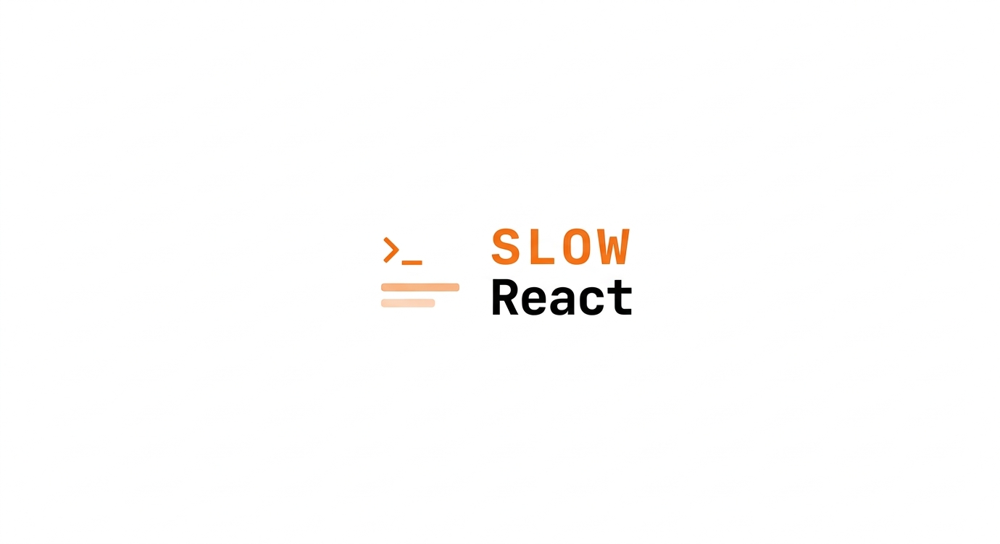

# Slow React

A collection of real React performance problems for you to solve.

Each problem is intentionally written with bad practices. Your job is to identify what is wrong and fix it using React best practices.
<a alt="Slow React logo" href="https://slowreact.vercel.app/" target="_blank" rel="noreferrer">

</a>

## Motivation

I created this repository as a personal way to practice React performance topics that have come up in technical interviews. The inspiration came from the article [How to Measure and Optimize React Performance](https://www.debugbear.com/blog/measuring-react-app-performance) by Anna Monus, from which I learned a lot. If you haven't read it, start there.

Most React performance content shows you the solution. This project shows you the problem and lets you figure out the rest. The goal is to build muscle memory for spotting performance issues in real codebases.

## The Pokémon analogy

Each exercise is a wild encounter. The component has a real performance problem — your job is to open React DevTools, profile it, and catch the issue before it escapes.

Just like a Pokémon trainer doesn't memorize every move — they learn to read the battle — a good React developer doesn't memorize every optimization. They learn to spot the pattern.

| Pokémon        | Problem                | Why                                            |
| -------------- | ---------------------- | ---------------------------------------------- |
| Magikarp       | Unnecessary Re-renders | Lots of effort, zero result                    |
| Bill's PC      | List Virtualization    | Stores hundreds, shows only the current box    |
| HM Slave       | Bad State Placement    | Pollutes the move set of whoever holds it      |
| Pokédex        | Heavy Bundle           | Don't load all 1010 before showing the first   |
| Quick Claw     | Slow Interactions      | Prioritizes who needs to move first            |
| Corrupted Save | Costly Hydration       | 30 seconds to load a game you already finished |

> 💡 **Want to contribute?** You don't have to use Pokémon. The analogy can be anything — cooking, sports, movies, music — as long as it makes the performance problem click for someone who has never heard of React. If you can explain it to a non-developer, it belongs here.

---

## How the challenge works

## How it works

1. **Read the docs** — start at [slowreact.vercel.app](https://slowreact.vercel.app/) to understand the context of each exercise.
2. **Clone the repository** — get the code running locally.
3. **Open the exercise folder** — each problem has its own `README.md` with a detailed explanation of the issue, what to look for, and references to help you solve it.
4. **Fix the problem** — no spoilers in the code. The solution is yours to find.

That's it. No magic, no hand-holding.

## Problems

| #   | Problem                | Concept                         |
| --- | ---------------------- | ------------------------------- |
| 01  | Unnecessary Re-renders | memo, useMemo, useCallback      |
| 02  | Bad State Placement    | state colocation, prop drilling |
| 03  | List Virtualization    | windowing, react-window         |
| 04  | Heavy Bundle           | tree shaking, lazy imports      |
| 05  | Slow Interactions      | useTransition, useDeferredValue |
| 06  | Costly Hydration       | SSR, React Server Components    |

## Getting started

```bash
git clone git@github.com:ManuelPauloAfonso/slowreact.git
cd slow-react
pnpm install
pnpm dev
```

## How to work on a problem

1. Open the problem folder inside `src/problems/`
2. Read the `README.md` inside the folder
3. Open `Problem.tsx` and identify what is wrong
4. Fix it directly in the file
5. Use React Developer Tools Profiler to validate your solution

## Stack

- Vite
- React 19
- TypeScript

## Contributing

See [CONTRIBUTING.md](./CONTRIBUTING.md)
